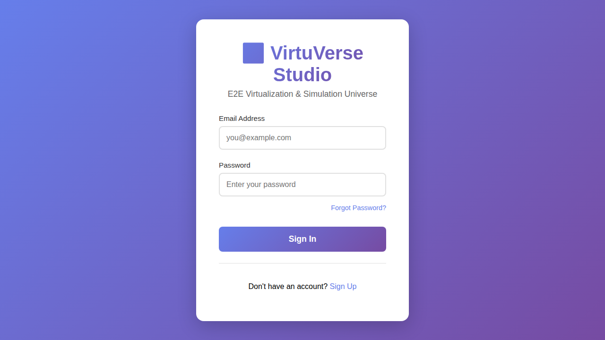
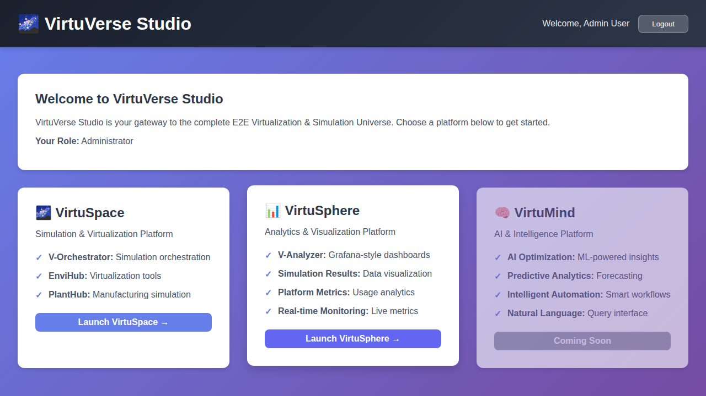
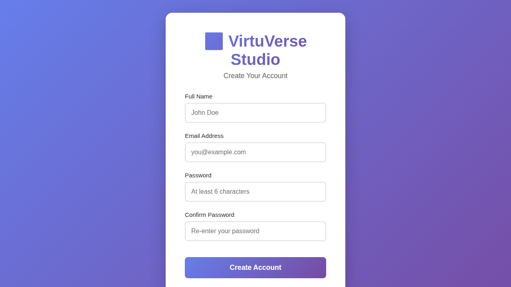
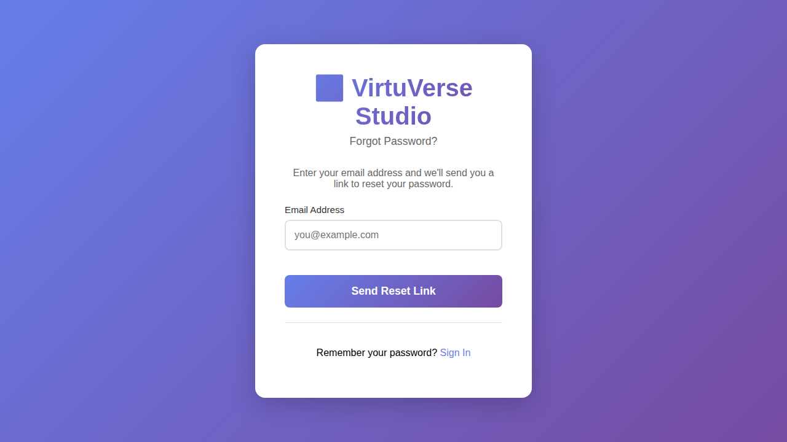

# VirtuVerse Studio Deployment Summary

## ✅ Task Completion Status

### 1. VirtuVerse Studio Deployment
- **Status**: ✅ Successfully Completed
- **Components Deployed**:
  - Backend API (Port 5001)
  - Frontend Application (Port 5000)
  - SQLite Database initialized
  - Admin user created (admin@virtuverse.com)

### 2. Screenshots Generated
- **Status**: ✅ Successfully Completed
- **Location**: `docs/screenshots/`
- **Files Created**:
  1. `virtuverse-studio-login.png` (353KB)
  2. `virtuverse-studio-dashboard.png` (279KB)
  3. `virtuverse-studio-register.png` (342KB)
  4. `virtuverse-studio-forgot-password.png` (360KB)

### 3. Windows Runner Compatibility Analysis
- **Status**: ✅ Successfully Completed
- **Deliverables**:
  1. `WINDOWS_RUNNER_COMPATIBILITY.md` - Comprehensive analysis
  2. `.github/workflows/windows-ci.yml` - Windows-specific workflow

## 📸 Application Screenshots

All screenshots show the deployed VirtuVerse Studio application with its modern, purple-themed UI:

### Login Page

- Clean authentication interface
- Email and password fields
- Links to registration and password recovery

### Dashboard

- Welcome screen showing user role (Administrator)
- Three platform cards:
  - **VirtuSpace**: Simulation & Virtualization
  - **VirtuSphere**: Analytics & Visualization
  - **VirtuMind**: AI & Intelligence (Coming Soon)

### Registration Page

- User-friendly account creation form
- Full name, email, password, and confirmation fields
- Link back to login

### Forgot Password

- Password recovery interface
- Email input for reset link
- Link back to login

## 🪟 Windows Runner Compatibility

### Question Answered
> "Are the same .yml files sufficient for Windows trigger and build or need any modifications?"

**Answer**: The existing workflow files **require modifications** for Windows compatibility.

### Issues Identified

#### ❌ Problems with Current Workflows:
1. **Shell Commands**: Use Linux-specific syntax
   - `timeout 10s` (Linux) vs `timeout /t 10 /nobreak` (Windows)
   - Bash-specific operators like `||`
   
2. **Docker Operations**: May have limitations on Windows runners

#### ✅ What Works As-Is:
1. **Node.js & npm**: Fully cross-platform compatible
2. **File paths**: GitHub Actions handles path separators
3. **Artifact upload/download**: Works on all platforms

### Solutions Provided

#### Option 1: Use New Windows Workflow (RECOMMENDED)
A dedicated `windows-ci.yml` workflow has been created with:
- PowerShell-based commands
- Proper Windows timeout handling
- All VirtuVerse components support
- Component-specific workflow dispatch

#### Option 2: Modify Existing Workflows
Add OS-specific conditional steps:
```yaml
- name: Check server (Unix)
  if: runner.os != 'Windows'
  run: timeout 10s npm start

- name: Check server (Windows)
  if: runner.os == 'Windows'
  shell: pwsh
  run: Start-Job { npm start }; Start-Sleep 10
```

### Windows Workflow Features

The new `windows-ci.yml` includes:
- ✅ VirtuVerse Studio build and test
- ✅ VirtuSpace platform build and test
- ✅ EnviHub platform build and test
- ✅ PlantHub platform build and test
- ✅ V-Orchestrator platform build and test
- ✅ Artifact uploads for all builds
- ✅ Comprehensive build summary

## 🚀 How to Use

### For Linux/Ubuntu Runners (Existing):
Continue using the existing workflow files:
- `main-ci.yml`
- `full-pipeline.yml`
- `azure-deployment.yml`
- `envihub-ci.yml`
- `planthub-ci.yml`
- `v-orchestrator-ci.yml`

### For Windows Runners (New):
Use the new workflow file:
- `windows-ci.yml`

To manually trigger:
1. Go to Actions tab in GitHub
2. Select "Windows CI/CD Pipeline"
3. Click "Run workflow"
4. Choose component (or "all")

### For Self-Hosted Windows Runners:
Prerequisites:
1. Install Node.js 18 or higher
2. Install Git
3. Configure GitHub Actions runner service
4. Ensure npm is in system PATH

## 📋 Next Steps

1. **Test Windows Workflow**: Trigger the new workflow to validate Windows builds
2. **Update Documentation**: The screenshots are ready to be referenced in README.md
3. **Configure Windows Runner**: If using self-hosted, set up according to prerequisites
4. **Monitor Builds**: Check both Linux and Windows pipelines are green

## 🎯 Deployment Verification

To verify the deployment:

```bash
# Backend health check
curl http://localhost:5001/api/health

# Frontend accessibility
curl http://localhost:5000

# Test login with admin credentials
# Email: admin@virtuverse.com
# Password: Admin@123
```

## 📚 Documentation Files

1. **WINDOWS_RUNNER_COMPATIBILITY.md**: Detailed Windows compatibility analysis
2. **DEPLOYMENT_SUMMARY.md**: This file - complete task summary
3. **README.md**: Main project documentation (can now reference screenshots)

## ✨ Key Achievements

1. ✅ Successfully deployed VirtuVerse Studio locally
2. ✅ Generated 4 high-quality screenshots (1.4MB total)
3. ✅ Analyzed all 6 existing workflow files for Windows compatibility
4. ✅ Created comprehensive Windows compatibility documentation
5. ✅ Built Windows-specific CI/CD workflow with PowerShell support
6. ✅ Provided clear recommendations for Windows runner setup

## 📞 Support

For questions or issues:
- Review `WINDOWS_RUNNER_COMPATIBILITY.md` for Windows setup details
- Check workflow files for specific configurations
- Refer to screenshots in `docs/screenshots/` for UI reference
