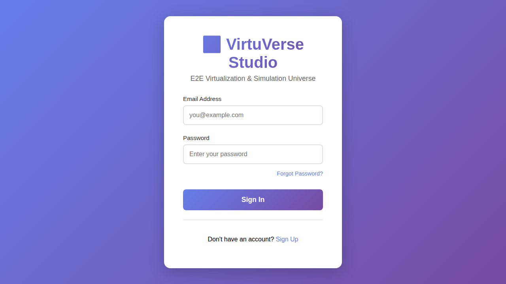
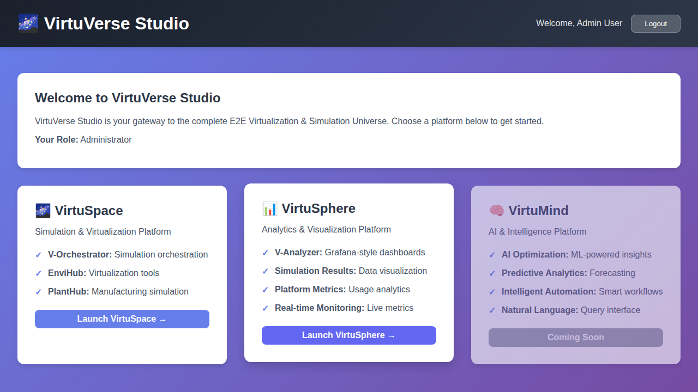

# VirtuVerse Studio

VirtuVerse Studio is the complete E2E Virtualization & Simulation Universe that serves as the entry point for the entire platform. It provides authentication and access to VirtuSpace, VirtuSphere, and VirtuMind, all integrated with **SmartHarness** AI assistance.

## Features

- **User Authentication**: Complete login, signup, and password recovery system
- **User Management**: Database-backed user management with admin support
- **Secure Access**: JWT-based authentication
- **Platform Integration**: Access to VirtuSpace, VirtuSphere, and VirtuMind
- **SmartHarness**: AI-enabled component providing intelligent assistance across all platforms
- **Backend Integrations**: VM connections, PostgreSQL, JFrog Artifactory, GitHub, and Azure AI

## Architecture

```
VirtuVerse Studio (Authentication Layer)
    ├── VirtuSpace (Integration Layer)
    │   ├── V-Orchestrator (Simulation Orchestration) [SmartHarness]
    │   ├── EnviHub (Virtualization & Simulation) [SmartHarness]
    │   └── PlantHub (Plant Simulation & Manufacturing) [SmartHarness]
    ├── VirtuSphere (Analytics & DevOps Layer)
    │   ├── V-Analyzer (Analytics Dashboards) [SmartHarness]
    │   └── V-DevContainers (DevContainer Generation)
    └── VirtuMind (AI Platform - Coming Soon) [SmartHarness]
```

### SmartHarness Integration

SmartHarness is available throughout VirtuVerse Studio, providing:
- **Unified AI Assistance**: Consistent AI-powered help across all platforms
- **Intelligent Navigation**: Smart recommendations for which platform/tool to use
- **Cross-Platform Analysis**: Evaluate models and simulations across different tools
- **Contextual Help**: Platform-specific guidance based on user actions
- **Quick Start Assistance**: Help new users get started quickly

## Getting Started

### Quick Setup (Recommended)

For a quick and automated setup, use the setup script:

```bash
cd VirtuVerse-Studio
./setup-backend.sh
```

This will automatically:
- Create the database directory
- Copy `.env.example` to `.env`
- Install all dependencies
- Initialize the admin user

For detailed setup instructions and troubleshooting, see [BACKEND_SETUP.md](BACKEND_SETUP.md).

### Prerequisites

- Node.js v14 or higher (v18 or v20 recommended)
- npm or yarn
- SQLite for development (included with better-sqlite3)

### Installation

1. Install backend dependencies:
```bash
cd VirtuVerse
npm install
```

2. Install frontend dependencies:
```bash
cd frontend
npm install
cd ..
```

3. Set up environment variables:
```bash
cp .env.example .env
# Edit .env with your configuration
```

4. Initialize the database with admin user:
```bash
npm run init-admin
```

5. Start the development server:
```bash
npm run dev
```

The application will be available at:
- Frontend: http://localhost:5000
- Backend API: http://localhost:5001

## Default Admin Credentials

- Email: admin@virtuverse.com
- Password: Admin@123

**Important**: Change these credentials immediately after first login in a production environment.

## Backend Integrations

VirtuVerse Studio now includes powerful backend integrations for enhanced functionality:

### Available Integrations

1. **VM Connection** - Connect to virtual machines for accessing tools to edit/modify models
2. **PostgreSQL Database** - Advanced data storage and querying capabilities
3. **JFrog Artifactory** - Artifact management and storage
4. **GitHub Repository** - Version control and collaboration
5. **Azure AI** - AI-powered chatbot and model analysis using Azure OpenAI

### Quick Setup

See [BACKEND_INTEGRATIONS_README.md](BACKEND_INTEGRATIONS_README.md) for detailed setup instructions.

For API documentation, see [BACKEND_INTEGRATIONS_API.md](BACKEND_INTEGRATIONS_API.md).

### Integration Status

Check all integration statuses via the API:
```bash
GET /api/integrations/status
```

This endpoint returns the configuration status of all available integrations.

## Deployment

For production deployment, see [DEPLOYMENT.md](DEPLOYMENT.md) for Docker and hosting instructions.

## UI Screenshots

### VirtuVerse Studio Login Page

*Secure authentication portal for VirtuVerse Studio*

### Platform Selection Dashboard

*Main dashboard showing access to VirtuSpace, VirtuSphere, and VirtuMind*

### SmartHarness Assistant

*SmartHarness providing intelligent navigation and platform recommendations*

### User Management Interface

*Admin interface for user management and access control*

> **Note**: Place actual screenshots in `VirtuVerse-Studio/docs/screenshots/` directory once deployed.
